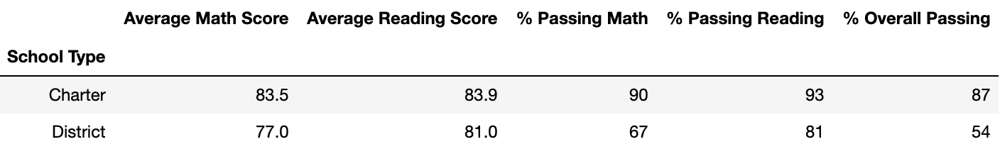

# Py City School District Analysis

## Overview
Performing an analysis using school and student data to inform a school district on their budget and priorities.

### Purpose
To interpret the Py City School district student data.

* Use Python and Pandas library to analyze school distrct data and showcase trends in school performance based on key metrics.
* Use Jupyter Notebook to visualize data outcomes as table format.
* This analysis assists the school board and district level in making desicions of budgets and priorities.

## Process of the Project
* Read raw data in csv file.
* Clean and inspect data, correct inappropriate data.
* Merge datasets to create new DataFrame gathering more information.
* Perform calculations  for key metrics use groupby() function.
* Visualize data with tables to tell story and showcase trends.

### School District Summary

For the 15 high schools in the district when assessing the average scores and passing percentages, the average math score was lowered by 0.1, the average reading score remained the same, the percentage passing for math was reduced by 1%, same with the percentage passing reading which declined by 1%, the overall passing percent reduced by 1%.

### School Summary

### Top Five Performing Schools

### Bottom Five Performing Schools

For the school size summary, taking out the 9th grade scores did not impact the average math and reading scores, however it impacted the passing percentages especially for the medium-sized schools (1,000-2,000). Where the % passing math, % passing reading, and % overall passing dropped 6% each. The performance for the medium-sized schools was perceived to be high before the change with 91% overall passing, after the change it became 85% which lowered its rank from first to second.

The ranking of the top five high schools was impacted by the score replacements when assessing school summaries and performing schools, we see that Thomas High School was ranked second in the top five performing with a 91% overall passing. Yet, after the score replacements its overall passing became 65% which got it removed out of top five. On the bright side, Thomas High School did not go down to the bottom five schools (those remained the same). With the revised school summary, Thomas High School ranks 8th among the 15 high schools in the district.

### Average Math Scores by Grade & School

### Average Reading Scores by Grade & School

For this data replacement the math and reading scores did not change which is something positive. From the tables above we see that for 9th grade at Thomas High School the table shows “NaN” where on the other side the remaining data was unchanged.

### School Spending Summary

For the spending summary, the spending ranges for the average math and reading scores were unchanged with the data change. However, with the data change, the passing percentages spending range was changed. As shown in the table, there is a decline of 6% in the percentage passing math, a 7% in the percentage passing reading, and a decline by 6% in the overall passing in the $630-644 spending range.

### School Size Summary

### School Type Summary

